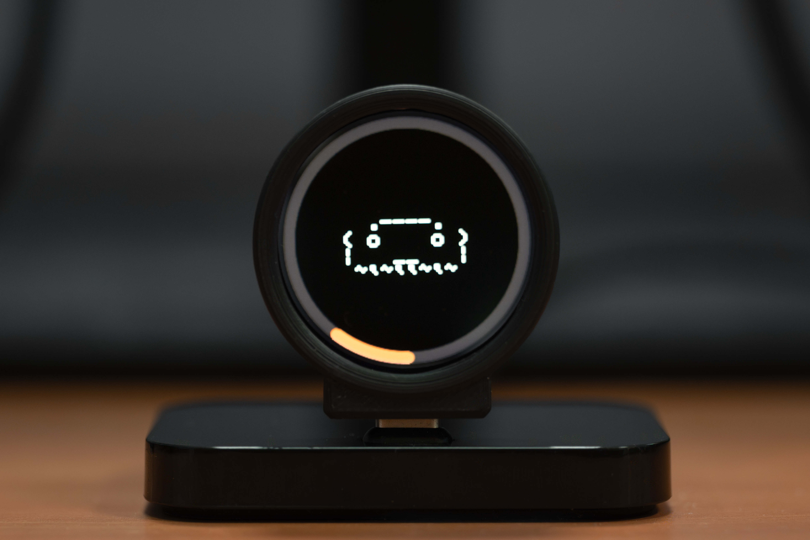

# buddy-ball

A Claude hardware buddy variant for the ESP32-S3 with a GC9A01 1.28" circular LCD. It connects to Claude for macOS and Windows over Bluetooth LE and displays a live animated buddy that reacts to your Claude sessions, plus token-count rings showing session and weekly usage.

<p align="center">
  
</p>

This is an alternative to the M5StickCPlus reference implementation in [claude-desktop-buddy](https://github.com/anthropics/claude-desktop-buddy). The BLE protocol is identical; only the hardware and display differ.

## Hardware

- **Board**: [Waveshare ESP32-S3-LCD-1.28](https://www.waveshare.com/product/esp32-s3-lcd-1.28.htm) — an all-in-one module with the ESP32-S3 and a GC9A01 240×240 circular display on a single PCB. No external wiring needed; the display is connected internally.

## Flashing

Install [PlatformIO Core](https://docs.platformio.org/en/latest/core/installation/), then from this directory:

```bash
pio run -t upload
```

## Pairing

Enable developer mode in Claude desktop (**Help → Troubleshooting → Enable Developer Mode**), then open **Developer → Open Hardware Buddy…**, click **Connect**, and pick your device. It advertises as `Claude-XXXX` (last two bytes of its BT MAC address).

For the full BLE wire protocol, see [`claude-desktop-buddy/REFERENCE.md`](https://github.com/anthropics/claude-desktop-buddy/REFERENCE.md).

## Display

The circular screen has two layers:

- **Token rings** — updated at 1 Hz. A white arc shows session tokens; a orange arc shows the rolling weekly total. They overlap at the same ring position so progress at both timescales is visible at a glance.
- **Buddy animation** — updated at ~10 fps. The buddy cycles through five states:

| State | Trigger |
| --- | --- |
| `sleep` | BLE not connected |
| `idle` | Connected, no active sessions |
| `busy` | Sessions actively running |
| `attention` | Approval prompt waiting |
| `celebrate` | Level-up (every 50 K session tokens) |

## ASCII pets

Eighteen species are compiled in (`src/buddies/`): capybara, duck, goose, blob, cat, dragon, octopus, owl, penguin, turtle, snail, ghost, axolotl, cactus, robot, rabbit, mushroom, chonk. The default is blob (`DEFAULT_SPECIES=3` in `platformio.ini`). Change the build flag to switch species at compile time.

## Case

A 3D-printable two-part enclosure for the Waveshare ESP32-S3-LCD-1.28 is in `case/`.

## Project layout

```
src/
  main.cpp        — setup/loop, state machine
  buddy.cpp/h     — species dispatch and render helpers
  buddies/        — one file per species, five animation functions each
  ble_bridge.cpp  — Nordic UART BLE service
  display.cpp/h   — TFT_eSPI ring and buddy rendering
  data.h          — wire protocol, JSON parsing
  commands.h      — command/ack handling
  stats.h         — NVS-backed token stats and settings
  week_tracker.h  — rolling weekly token accumulator
case/
  front.stl       — front shell (display side)
  back.stl        — back shell
```

## License

Copyright 2026 Fan Zirui. Released under the [MIT License](LICENSE).

This project builds on the BLE protocol and ASCII pet artwork from [claude-desktop-buddy](https://github.com/anthropics/claude-desktop-buddy), copyright 2026 Anthropic, PBC, also MIT licensed.
